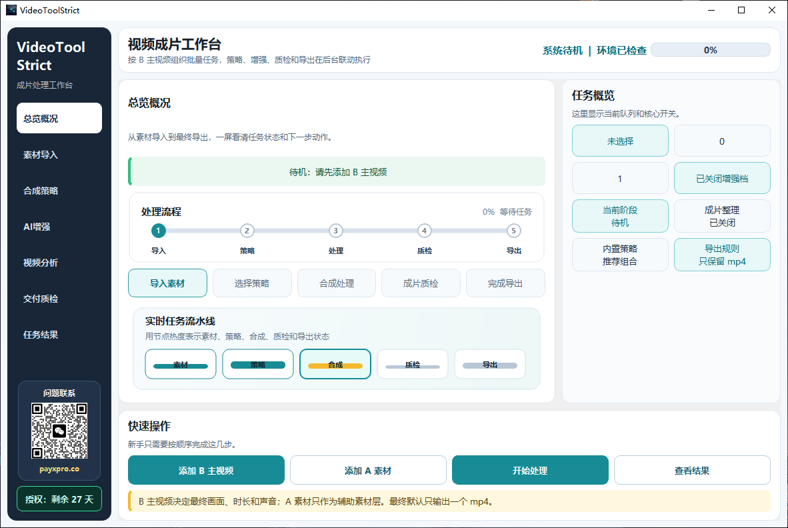
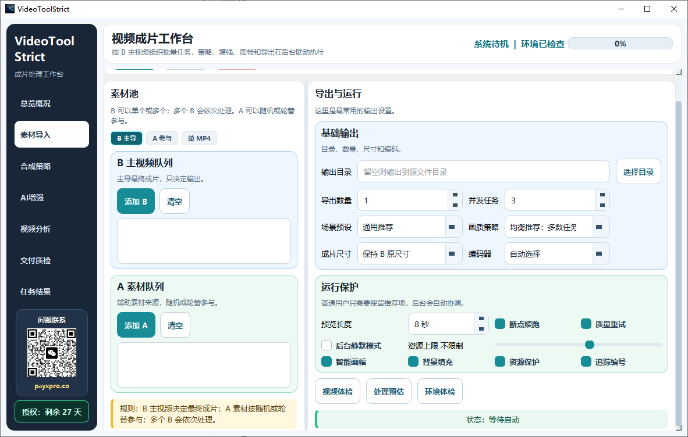
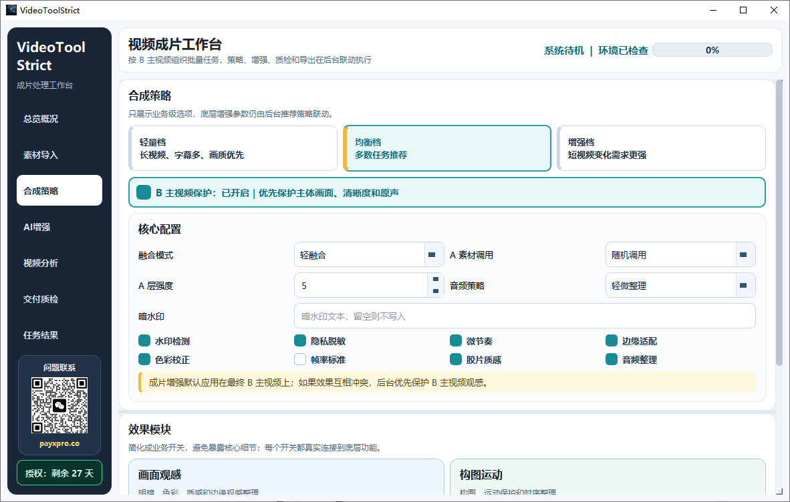
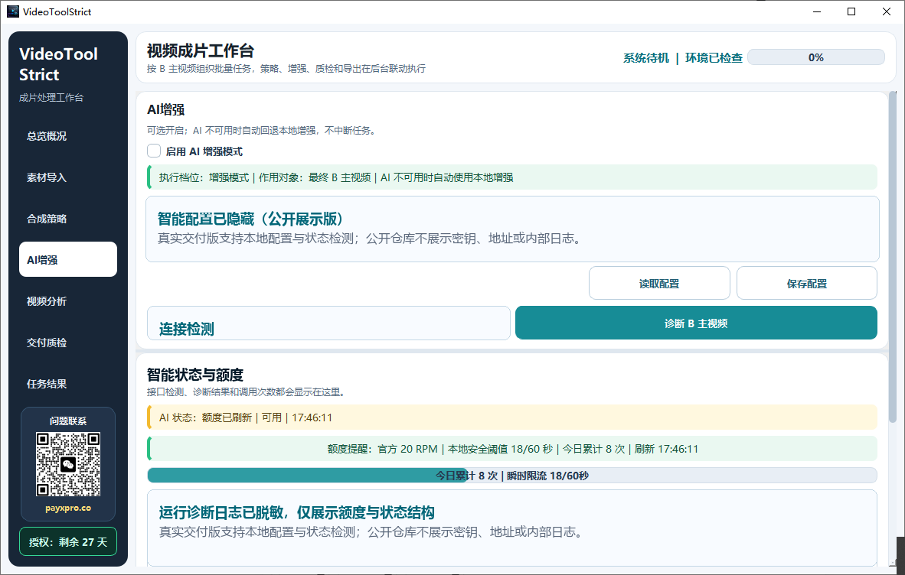
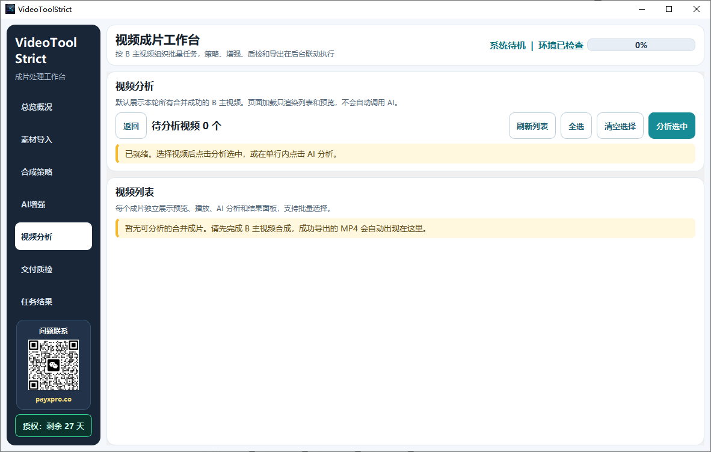
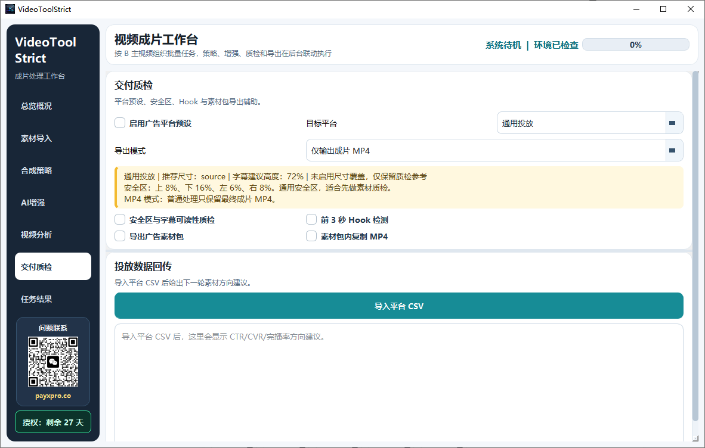
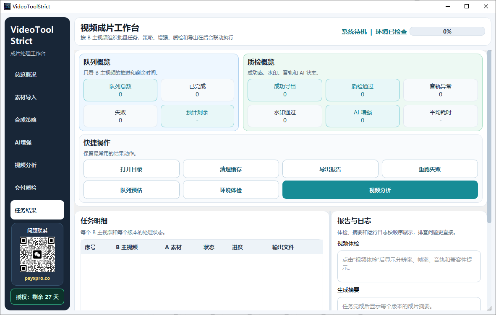

# 🛡️ VideoToolStrict - AI 驱动的视频特征混淆与多维融合引擎

> **传统去重已死，AI 混淆时代到来。**
> 专为短视频矩阵、多平台分发与出海业务打造的本地化处理神器。内置 **5 大核心引擎** 与 **30+ 项像素级去重策略**，通过 AI 敏感帧动态拦截与独创的 A/B 多维融合技术，彻底重构视频底层指纹，有效对抗 TikTok/抖音/YouTube 的严苛风控与查重算法。

## 产品定位

它把素材导入、合成策略、AI 增强、视频分析、交付质检、任务结果和授权管理收束到同一个桌面端流程里，让原本分散在剪辑软件、表格、投放后台和人工检查里的工作，变成一条更清晰、更稳定、更可复制的交付流水线。

## 🎯 为什么需要这个工具？

在短视频矩阵运营、多平台分发及出海（TikTok/YouTube）业务中，**“防风控与高过审率”** 是第一生产力。传统剪辑软件无法解决以下痛点：

- ❌ **平台查重算法严苛**：简单的裁剪、加滤镜已无法绕过 MD5、画面指纹、音频指纹的三重校验。
- ❌ **敏感信息误判率高**：人工排查耗时费力，极易因子平台（如抖音与 TikTok）审核尺度差异导致封号。
- ❌ **数据隐私风险**：将视频上传至第三方“洗稿”工具，存在严重的数据泄露风险。

**VideoToolStrict** 采用纯本地化运行，从底层重构视频特征，为专业运营团队提供安全、高效、高过审率的标准化工作流。

---

## 🚀 嵌入 AI 后，我们做了什么降维打击？

传统的视频处理工具依赖“死板规则”（如：每隔 10 秒全局模糊、统一加一层滤镜），这不仅严重破坏观看体验，且早已被平台的 AI 查重算法轻易识破。

**VideoToolStrict 引入 AI 视觉大模型后，实现了从“盲目破坏”到“精准手术”的跨越：**

### 1. 🎯 AI 敏感帧动态拦截 (Smart Evasion)
- **过去**：人工逐帧排查，或粗暴地给整个画面打码，导致视频作废。
- **现在**：AI 模型以毫秒级速度逐帧扫描，**精准定位**画面中的敏感元素（特定人物、违规标识、不合规动作）。
- **升级效果**：仅对敏感区域进行**动态局部高斯模糊、马赛克或智能画面替换**。在完美保留视频整体观感和完播率的前提下，精准规避平台审核红线。

### 2. 🎨 AI 智能构图分析 (Smart Composition)
- **过去**：盲目裁剪画面，导致主体丢失，用户划走率极高。
- **现在**：AI 自动识别视频的“视觉中心”和“运动主体”。
- **升级效果**：在进行画面微调、去重裁剪或生成 A/B 融合背景时，AI 确保**核心主体始终处于最佳视觉位置**，保障二次创作的完播率。

---

## 🌟 深度解析：视频多维融合引擎

在对抗平台“构图级查重”和“运动轨迹比对”时，简单的像素混淆已经不够。**A/B 视频合成（多维融合）** 是我们对抗风控算法的终极武器。

**什么是 A/B 融合？**
将原视频 (A) 与另一视频/背景 (B) 通过上下分屏、画中画、左右对比、背景虚化扩展等方式进行像素级重组。

**为什么它是防查重的“核武器”？**

1.  **💥 彻底粉碎“构图指纹”**
    平台的查重算法不仅比对像素，还会提取画面的“构图特征”和“主体运动轨迹”。A/B 融合直接改变了原视频的画幅比例、主体位置和背景信息，让查重算法提取到的全局特征完全失效。
2.  **📈 几何级增加“画面信息熵”**
    引入 B 视频（如：解说员画面、反应视频、动态背景）后，视频的整体信息熵大幅增加。在平台算法眼中，这不再是“搬运”，而是具备极高 **“原创度”** 的二次创作。
3.  **💰 完美契合高流量业务场景**
    原生支持“解说+原片”、“Reaction(反应)视频”、“双屏对比”、“游戏+实拍”等极易获取流量的二创形式，**在过审的同时，提升内容的商业价值**。

---

## 🧰 全功能矩阵 (Full Feature List)

### 🧬 1. 像素级特征混淆 (Pixel Obfuscation)
- [x] **不可见噪点注入**：注入人眼无法察觉的像素级噪点，彻底改变视频底层哈希值。
- [x] **色彩空间微调**：HSL/RGB 偏移，破坏画面色彩指纹。
- [x] **智能抽帧/插帧**：微调时间轴，破坏音频与画面的同步校验特征。
- [x] **边缘畸变处理**：极微小的镜头畸变，对抗平台的几何特征比对。

### 🎵 2. 音频指纹伪造 (Audio Fingerprinting)
- [x] **超声波频段注入**：在人耳听不到的频段注入特征信号，干扰音频查重。
- [x] **采样率/比特率动态重构**：不改变音质听感，但彻底重写音频底层编码。
- [x] **环境音智能混音**：自动混入极低音量的白噪音或环境音，破坏音频波纹比对。

### 🧹 3. 元数据与溯源清洗 (Metadata Purge)
- [x] **深度 EXIF 剥离**：清除拍摄设备、GPS、剪辑软件痕迹。
- [x] **隐形水印检测与清除**：针对主流平台植入的溯源暗水印进行干扰与洗除。

### ⚙️ 4. 工业级批量调度 (Batch Processing)
- [x] **任务队列管理**：支持上千个视频的并发处理与断点续传。
- [x] **全中文诊断日志**：告别晦涩的 FFmpeg 英文报错，精准定位处理失败原因。
- [x] **多平台预设策略**：内置 TikTok、YouTube、抖音、小红书等不同平台的推荐去重参数组合。

---

## 🚀 快速开始

### 环境要求
- **操作系统**：Windows 10 / 11 (64位)
- **运行库**：已内置定制版 FFmpeg/FFprobe 与 AI 推理引擎，**开箱即用，无需配置环境**。

### 生产闭环

AI 嵌入后，工具的价值从“批量处理视频”升级为“批量生产 + 内容诊断 + 交付质检 + 创意复盘”。它帮助团队减少人工反复观看、人工总结和人工写复刻提示词的时间，把更多精力放在选题、素材和投放策略上。

## 页面展示

### 1. 总览概况

一屏展示任务状态、处理流程、实时流水线、快捷操作、授权剩余时间和联系入口。适合打开工具后快速判断下一步动作。

### 2. 素材导入

围绕 B 主视频与 A 素材构建导入区，输出、尺寸、并发、运行保护和环境检查集中展示。适合批量素材进入生产线前的准备工作。

### 3. 合成策略

将合成策略拆成可理解的业务档位，并把 B 主视频保护状态放到明显位置，减少新手误选和误操作。

### 4. AI 增强

AI 能力采用手动配置与状态检测方式呈现，公开展示版本已隐藏敏感配置和内部日志信息。

### 5. 视频分析

视频分析页默认不自动消耗 AI 额度。成功生成的视频会进入列表，用户可手动选择、全选分析，并查看分析结果。

### 6. 交付质检

面向投放素材交付，提供平台预设、安全区、Hook 检测、广告素材包、单 MP4 输出和数据回传入口。

### 7. 任务结果

任务结果页承担最终交付中枢角色，展示队列概览、质检概览、快捷操作、任务明细、报告与日志。

## 适用场景

- MCN 与达人矩阵团队：批量处理素材、统一交付规范、缩短人工操作时间。
- 电商短视频团队：统一管理产品素材、种草视频、讲解视频和投放版本。
- 广告投放团队：围绕成片、封面、质检和回传数据形成素材闭环。
- 内容中台团队：把分散素材变成可预检、可分析、可交付的标准化资产。
- 私域与独立站团队：用更轻量的桌面工作流完成素材准备和多版本输出。

## 获取与商务合作

当前仓库仅作为产品展示、版本更新和联系入口使用，不提供源码、不提供核心实现、不公开内部参数。

官网：[https://payxpro.co](https://payxpro.co)

⚠️ 免责声明 (Disclaimer)

本工具旨在为视频创作者、版权所有者及专业运营团队提供内容合规性辅助与数据隐私保护技术。
本工具仅用于处理您拥有合法版权或授权的视频内容。
用户在使用本工具时，必须遵守所在国家/地区的法律法规，以及目标平台的服务条款 (TOS)。
开发者不对用户因滥用本工具（如用于侵权、传播违规内容）而导致的任何法律后果或平台判罚承担责任。
