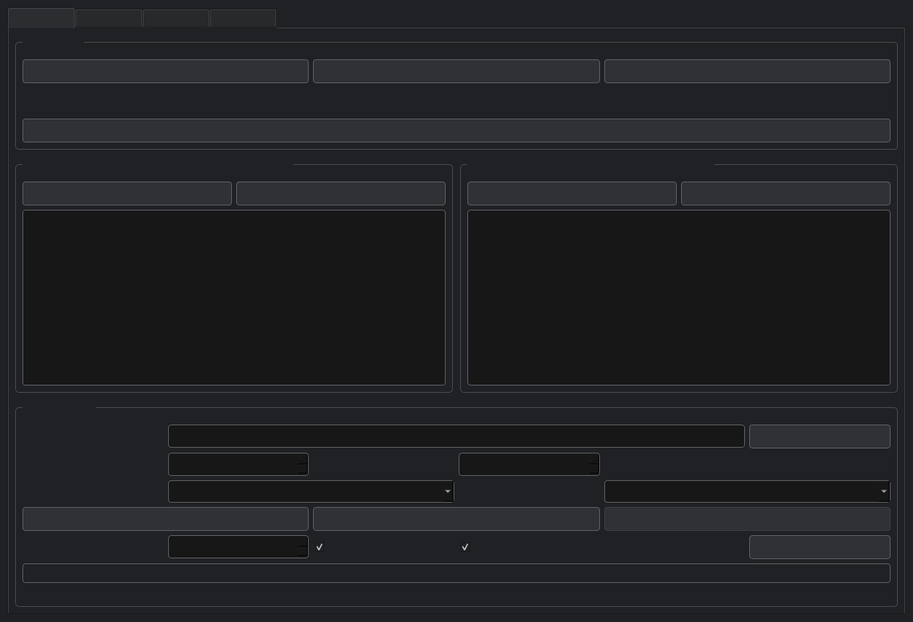
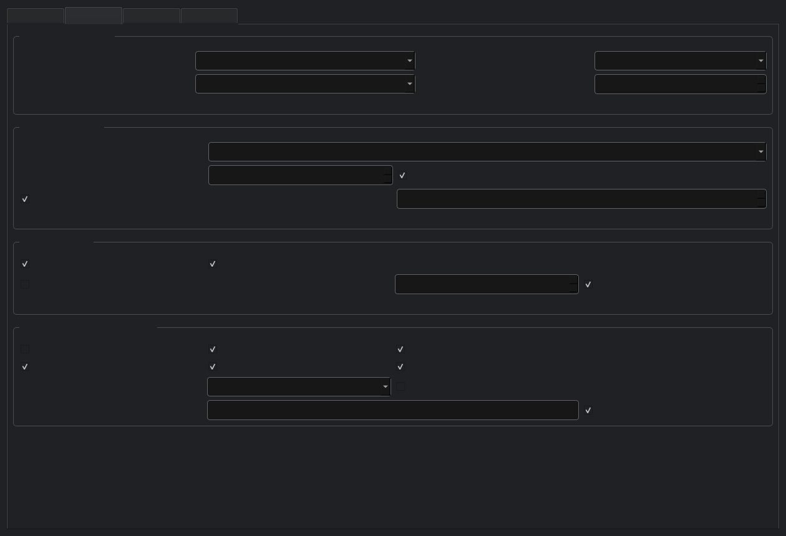
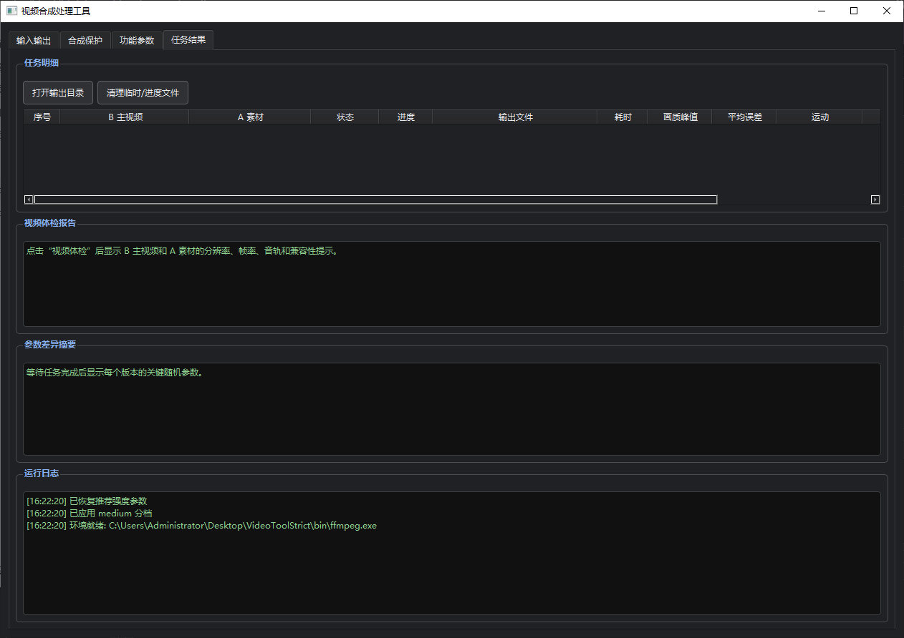

# VideoToolStrict

本仓库现仅作为 `VideoToolStrict` 的产品通知与版本更新页使用。

当前版本已完成一轮界面与交互更新，桌面端体验、激活入口、任务流程展示与交付包装均已同步替换。仓库不再提供源码、核心实现、构建脚本或程序内参数细节。

## 本次更新

- 已替换为新的桌面端交付版本
- 已同步新的激活页视觉样式与布局
- 已更新产品展示图与说明结构
- 已整理为仅展示、仅通知、仅引导的仓库形态

## 产品展示

### 输入与输出

### 合成与保护

### 结果与任务视图

## 获取与咨询

当前仓库不提供公开源码与直接程序文件下载。

如需了解版本状态、体验安排或后续更新，可通过下方方式联系：

官网：[https://payxpro.co](https://payxpro.co)

## 仓库说明

本仓库不包含以下内容：

- 源代码
- 核心实现逻辑
- 构建脚本
- 可执行程序包
- 内部参数说明
- 训练、处理或调度细节

## Notice

This repository is maintained as a product notice page only.  
No source code or internal implementation details are published here.
