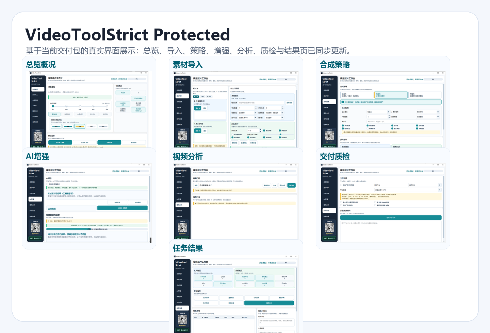

# VideoToolStrict Protected

> AI Native 视频资产工作台。  
> 面向批量短视频生产、素材治理、智能分析、交付质检与商业化投放协同的一体化桌面工具。

## 产品定位

VideoToolStrict Protected 不是一个简单的“批量剪辑小工具”，而是一套面向内容团队、投放团队、MCN、电商素材组和私域内容运营场景的 **视频成片工作台**。

它把素材导入、合成策略、AI 增强、视频分析、交付质检、任务结果和授权管理收束到同一个桌面端流程里，让原本分散在剪辑软件、表格、投放后台和人工检查里的工作，变成一条更清晰、更稳定、更可复制的交付流水线。

## 当前交付版亮点

- **AI 嵌入后的业务作用**：AI 不只是单独的“分析按钮”，而是嵌入素材理解、成片诊断、Hook 判断、受众画像、卖点提炼、质检辅助和爆款复刻提示词生成等关键节点，让视频从“能处理”升级为“能判断、能复盘、能指导下一轮生产”。
- **真实桌面端重构 UI**：侧边导航、顶部状态栏、页面卡片、任务状态和联系入口已统一重构。
- **批量素材工作流**：围绕 B 主视频批量处理，支持 A 素材参与、单 MP4 交付、输出目录和并发任务配置。
- **合成策略面板**：将复杂策略包装成轻量档、均衡档、增强档，突出 B 主视频保护开关与策略状态。
- **AI 增强与额度状态**：支持手动开启、配置保存、额度刷新、连接状态检测与本地降级思路，公开页已脱敏展示。
- **视频分析页面**：默认展示成功生成的视频，用户手动触发分析，支持全选、单条分析、结果查看与后续复刻。
- **交付质检闭环**：平台预设、安全区、Hook 检测、字幕可读性、素材包导出和投放数据回传入口统一展示。
- **任务结果中枢**：队列概览、质检概览、快捷操作、任务明细、报告与日志拆分展示。
- **商业授权体验**：未激活不进入工具主界面，支持周期授权、剩余时间展示、品牌 Logo 与安装包识别。

## AI 嵌入后的作用

VideoToolStrict Protected 的 AI 能力不是为了“看起来智能”，而是服务于成片生产、内容判断和交付复盘。它被放在用户真正需要决策的位置：导入后判断素材是否值得继续处理，合成后判断成片表达是否清晰，交付前检查素材是否适合发布，复盘时帮助团队沉淀下一轮创意方向。

### 内容理解

AI 会围绕合成后的视频内容做主题归纳，帮助用户快速判断这条视频到底在讲什么、是否有产品表达、目标受众是谁、适合什么使用场景。对带货、种草、口播、产品演示这类素材，重点突出产品卖点、用户痛点和表达完整度。

### Hook 与前段吸引力判断

AI 会把视频开头作为重点分析对象，辅助判断前 3 秒是否足够明确、是否能快速给出痛点、人物或产品是否出现得太晚、节奏是否拖沓。这样团队不用只凭感觉判断“开头强不强”，而是能拿到更清晰的优化方向。

### 受众画像与投放参考

AI 会结合文本、语音和内容表达，整理适合的人群标签，例如年龄层、使用场景、消费动机、痛点类型和内容风格倾向。它的作用不是替代投手判断，而是把视频内容转成更容易用于投放沟通和素材复盘的结构化信息。

### 交付质检辅助

AI 与交付质检页面配合，用来辅助关注安全区、字幕可读性、Hook 强弱、素材包完整度和成片交付状态。它让质检不只是“文件有没有生成”，而是进一步关注“这条素材是否更适合交付和投放”。

### 爆款复刻提示词

视频分析完成后，工具可以基于成片内容生成可复制的视频生成提示词。提示词会尽量覆盖视频语言、人物画像、场景、镜头节奏、字幕花字、产品表达、情绪氛围和视觉包装，方便用户把一条表现不错的视频拆解成下一轮视频模型创作的参考蓝本。

### 生产闭环

AI 嵌入后，工具的价值从“批量处理视频”升级为“批量生产 + 内容诊断 + 交付质检 + 创意复盘”。它帮助团队减少人工反复观看、人工总结和人工写复刻提示词的时间，把更多精力放在选题、素材和投放策略上。

## 页面展示

### 1. 总览概况

一屏展示任务状态、处理流程、实时流水线、快捷操作、授权剩余时间和联系入口。适合打开工具后快速判断下一步动作。

### 2. 素材导入

围绕 B 主视频与 A 素材构建导入区，输出、尺寸、并发、运行保护和环境检查集中展示。适合批量素材进入生产线前的准备工作。

### 3. 合成策略

将合成策略拆成可理解的业务档位，并把 B 主视频保护状态放到明显位置，减少新手误选和误操作。

### 4. AI 增强

AI 能力采用手动配置与状态检测方式呈现，公开展示版本已隐藏敏感配置和内部日志信息。

### 5. 视频分析

视频分析页默认不自动消耗 AI 额度。成功生成的视频会进入列表，用户可手动选择、全选分析，并查看分析结果。

### 6. 交付质检

面向投放素材交付，提供平台预设、安全区、Hook 检测、广告素材包、单 MP4 输出和数据回传入口。

### 7. 任务结果

任务结果页承担最终交付中枢角色，展示队列概览、质检概览、快捷操作、任务明细、报告与日志。

## 适用场景

- MCN 与达人矩阵团队：批量处理素材、统一交付规范、缩短人工操作时间。
- 电商短视频团队：统一管理产品素材、种草视频、讲解视频和投放版本。
- 广告投放团队：围绕成片、封面、质检和回传数据形成素材闭环。
- 内容中台团队：把分散素材变成可预检、可分析、可交付的标准化资产。
- 私域与独立站团队：用更轻量的桌面工作流完成素材准备和多版本输出。

## 获取与商务合作

当前仓库仅作为产品展示、版本更新和联系入口使用，不提供源码、不提供核心实现、不公开内部参数。

官网：[https://payxpro.co](https://payxpro.co)

## 仓库边界

本仓库不会公开以下内容：

- 源代码
- 核心实现逻辑
- 内部策略参数
- 可执行程序包
- 授权生成逻辑
- 敏感配置、连接地址或内部日志
- 构建脚本与保护方案细节

如需试用、商务授权、定制部署或版本更新，请通过官网或二维码联系。
