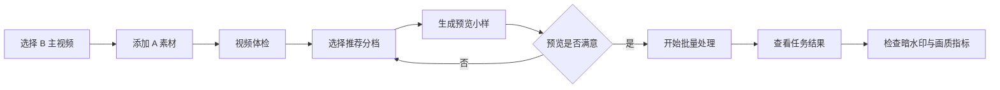

# VideoToolStrict

**本地化视频批量处理、A/B 合成、暗水印记录与画质保护桌面工具。**

VideoToolStrict 面向需要稳定处理视频素材的本地工作流：从视频体检、参数配置、预览小样，到批量导出、进度追踪、暗水印检测和处理报告，尽量把复杂的 FFmpeg 处理流程封装成一个中文桌面面板。

> 本仓库仅用于产品介绍、功能说明和联系引导，不包含源代码、正式程序包或打包产物。

## 产品定位

VideoToolStrict 不是在线视频服务，也不是需要部署的后端系统。它是一款 Windows 本地桌面工具，适合在自己的电脑上完成视频素材处理、批量导出、A/B 素材合成测试、暗水印记录和画质守门。

核心设计目标：

- **本地运行**：视频文件不需要上传到云端。
- **解压即用**：正式包内置 FFmpeg / FFprobe 和运行环境。
- **B 主视频优先**：以 B 主视频观看体验为核心，A 素材作为可控融合层。
- **参数可控**：提供低档、均衡档、增强档，也支持高级参数细调。
- **过程可见**：任务进度、预估耗时、输出状态、错误日志都能看到。
- **结果可查**：支持暗水印检测、画质指标、运动分析、参数差异摘要。

## 功能概览

| 模块 | 能力 | 说明 |
| --- | --- | --- |
| 输入输出 | B 主视频、A 素材、输出目录、导出数量 | B 主视频为最终观看主体，A 素材用于合成层 |
| 推荐分档 | 轻量档、均衡档、增强档 | 适合不同画质和处理强度需求 |
| A/B 合成 | 隐形融合、背景融合、画中画 | 默认推荐隐形融合，观看干扰最低 |
| 透明通道 | 自动推荐、原生透明、柔和融合、亮度蒙版、绿幕抠除 | 用于适配不同类型 A 素材 |
| 运动保护 | 运动感知、边缘羽化、超高速柔化 | 高运动画面中自动降低 A 层干扰 |
| 画质保护 | B 质量守门、自动降强度重试 | 保护 B 主视频整体观感 |
| 暗水印 | 文本写入、写入后检测 | 用于本地记录与结果确认 |
| 批量任务 | 多版本导出、断点续跑、任务进度 | 适合批量生成和中断后继续 |
| 预览小样 | 先导出短样片 | 避免长视频处理后才发现参数不合适 |
| 视频体检 | 分辨率、帧率、时长、编码、音轨 | 导入后快速判断素材状态 |
| 日志报告 | 参数摘要、错误日志、处理报告 | 方便复盘和排查问题 |

## 面板预览

建议在 `docs/images` 中放入真实截图，然后把下面的图片路径替换成你的文件名。

### 1. 输入输出面板

该面板用于完成基础任务配置：

- 选择唯一的 B 主视频，作为最终输出画面的主体。
- 添加一个或多个 A 素材，作为合成素材层。
- 设置输出目录、导出数量、并发任务、画质策略和编码器。
- 使用“生成预览”先导出短样片。
- 使用“视频体检”检查素材是否有音轨、编码是否正常、帧率和时长是否合理。
- 开启“断点续跑”后，已存在的输出文件会自动跳过。

### 2. 合成保护面板

该面板用于控制 A/B 合成和 B 主视频保护策略：

- A/B 合成支持关闭、可见画中画、背景融合、隐形融合。
- 默认推荐“隐形融合”，适合需要保持 B 主视频观看体验的场景。
- 透明通道工作流支持自动推荐、原生透明通道、柔和融合、亮度蒙版和绿幕抠除。
- 运动感知保护会根据 B 主视频运动状态，自动调整 A 层透明度和边缘羽化。
- B 质量守门会检查输出后的画质指标。
- 画质不佳时可自动降低 A 层强度重试。
- 暗水印支持写入文本，并在导出后检测是否写入成功。

### 3. 功能参数面板

该面板面向高级用户：

- 可单独启用或关闭不同处理项。
- 每项功能都有推荐强度参数。
- 推荐先使用“轻量档 / 均衡档 / 增强档”，再少量调整细节参数。
- 对画面影响较明显的功能建议配合预览小样使用。

### 4. 任务结果面板

该面板用于查看处理过程和结果：

- 任务明细显示每个导出版本的状态、进度、输出文件、耗时、画质峰值、平均误差、运动状态和水印检测结果。
- 视频体检报告会显示素材的基础技术信息和中文提示。
- 参数差异摘要会记录每个版本的关键随机参数。
- 运行日志用于查看批量处理过程、错误原因和完成状态。
- 可以打开输出目录，也可以清理临时文件、进度文件和错误日志。

## 推荐工作流

## 推荐参数

| 档位 | 适合场景 | 建议 |
| --- | --- | --- |
| 轻量档 | 长视频、字幕多、画质优先 | 改动最轻，适合先跑预览 |
| 均衡档 | 多数 A/B 合成和批量导出 | 推荐默认使用 |
| 增强档 | 短视频或需要更强变化的素材 | 建议开启画质守门并检查结果 |

## 使用方式

1. 获取正式工具压缩包。
2. 解压到本地文件夹。
3. 双击运行 `VideoToolStrict.exe`。
4. 选择 B 主视频。
5. 可选添加 A 素材。
6. 点击“视频体检”查看素材状态。
7. 选择推荐分档或调整高级参数。
8. 点击“生成预览”查看小样。
9. 确认效果后点击“开始处理”。
10. 在“任务结果”面板查看输出、进度、画质指标和水印检测状态。

## 下载与体验

当前工具为私有分发版本。如需体验、合作或定制，请联系：

- 邮箱：your-email@example.com
- 微信：your-wechat-id
- 网站：https://your-site.com

## 常见问题

### 是否需要安装依赖？

正式工具包不需要用户手动安装依赖。运行环境、FFmpeg、FFprobe 和桌面界面组件会随工具一起分发。

### 是否需要联网？

不需要。视频处理在本地完成。

### 为什么工具包体积较大？

工具内置 FFmpeg、FFprobe、Python 运行库和桌面界面依赖，因此体积会比普通小工具更大。

### 为什么建议先生成预览？

视频处理参数会影响画面细节、音频和导出耗时。先生成短小样可以快速判断参数是否合适，避免长视频完整处理后再返工。

### B 主视频和 A 素材分别是什么？

B 主视频是最终导出结果的观看主体。A 素材是合成素材层，可以用于画中画、背景融合或隐形融合。

## 合规说明

VideoToolStrict 仅用于合法的视频素材处理、格式转换、批量导出、版权归属标记和本地工作流优化。使用者应确保自己拥有相关素材的合法使用权。

请勿将本工具用于侵犯他人版权、违反法律法规、违反平台规则或其他不当用途。

## 仓库说明

本仓库仅作为产品介绍页，不包含：

- 源代码
- 正式程序包
- 第三方二进制文件
- FFmpeg 文件
- 用户素材
- 测试视频

## License

Copyright (c) 2026. All rights reserved.
